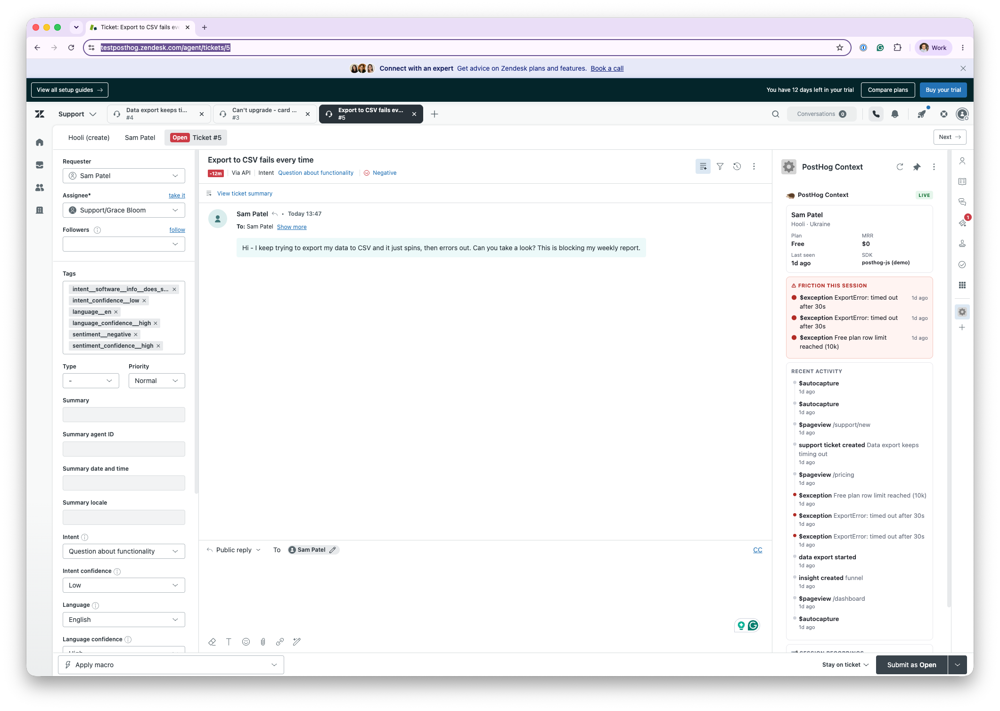

# PostHog ↔ Zendesk Bridge

**Closes "the context gap" — the first 3–5 minutes a support agent wastes asking questions PostHog already knows the answer to.**

When a ticket arrives, this surfaces the requester's PostHog context *right in the Zendesk sidebar*: their plan and MRR, what they were doing right before they wrote in, the errors they hit, links to their session recordings, and which feature flags they're on. No tab-switching, no "can you tell me your account email," no guessing.

> Built as a working POC, not a slide. It runs today against bundled mock data, and switches to live PostHog and Zendesk with a `.env` file. It's also deployed live and installed in a real Zendesk instance.



*A customer writes in: "export to CSV fails every time." Before the agent types a word, the sidebar already shows the answer, pulled live from PostHog: Free plan, two export timeouts, the plan row-limit, and a session recording of exactly what happened.*

---

## The story it tells

Open a ticket from `victoria+test@thetest.ai` (Victoria Lopez) — *"Can't upgrade, card keeps getting declined."* Before reading a word of back-and-forth, the agent sees:

- **Scale plan, $1,450 MRR** — this is a paying customer, route accordingly
- **⚠️ Friction this session:** two `$exception` events — `402 card_declined` from the billing service, minutes ago
- A **session recording** of the exact attempt, with 2 console errors
- They're on the **`new-billing-flow`** and **`checkout-v2`** flags — so this is reproducible and possibly flag-specific

The agent now opens the reply already knowing the answer. That's the whole point.

---

## Architecture

```
  Zendesk ticket                 enricher (FastAPI)              PostHog
 ┌──────────────┐   email      ┌───────────────────┐   REST   ┌──────────┐
 │ Sidebar app  │ ───────────▶ │  GET /api/context │ ───────▶ │ persons  │
 │ (ZAF iframe) │ ◀─────────── │   build_payload   │ ◀─────── │ events   │
 └──────────────┘   JSON       │                   │          │ replays  │
                                │  POST /webhooks/  │          │ flags    │
 ticket.created ──────────────▶│      zendesk      │──note──▶ (writes internal
                                └───────────────────┘          note back to ticket)
```

Two independent entry points, one shared data layer:

| Path | Trigger | What it does |
|------|---------|--------------|
| **Sidebar** (`zendesk-app/`) | Agent opens a ticket | ZAF iframe reads the requester email, calls `GET /api/context`, renders four panels |
| **Webhook** (`enricher/`) | `ticket.created` fires | Looks the requester up in PostHog, posts a markdown summary as an internal note |

The single seam that makes the whole thing demoable: **`PostHogClient`** returns the same `PersonContext` whether it read the live REST API or `fixtures/mock_data.json`. Everything downstream is backend-agnostic — see [`enricher/posthog_client.py`](enricher/posthog_client.py).

---

## Quickstart (mock data — no accounts needed)

```bash
# 1. Run the bridge
python3 -m venv .venv && ./.venv/bin/pip install -r enricher/requirements.txt
./.venv/bin/uvicorn enricher.app:app --port 8123

# 2. In another terminal, see the enrichment as the webhook would post it
./.venv/bin/python -m enricher.enrich victoria+test@thetest.ai

# 3. See the sidebar — serve the app and open it standalone
python3 -m http.server 5599
#   → http://localhost:5599/zendesk-app/assets/iframe.html?email=victoria%2Btest@thetest.ai&bridge=http://localhost:8123
#   (the %2B is an encoded "+"; a raw + in a URL query is read as a space)
```

Run the tests (fully offline):

```bash
./.venv/bin/python -m enricher.test_enrich
```

## Going live

1. Copy `.env.example` → `.env`, fill in your PostHog Personal API key + project ID (and Zendesk creds to enable note-posting).
2. Restart the bridge. `GET /health` now reports `"posthog_mode": "live"`. Nothing else changes.
3. Install the sidebar into a Zendesk sandbox — see [`docs/zendesk-setup.md`](docs/zendesk-setup.md).

---

## What's deliberately scoped out (v1)

- **Cohorts in live mode** need a separate paginated call — mock-only for now, noted in `posthog_client.py`.
- **Webhook auth/signing** — a production deploy would verify Zendesk's signature header; omitted to keep the POC readable.
- **Caching** — every sidebar open is a fresh fetch. Fine for a demo, would add a short TTL cache in production.

Each of these is a one-file change against the existing seam, not a rewrite — which is the point of building it this way.

---

## Layout

```
enricher/
  posthog_client.py   # live + mock backends behind one PersonContext interface
  enrich.py           # PersonContext -> markdown note + sidebar JSON; CLI preview
  app.py              # FastAPI: GET /api/context, POST /webhooks/zendesk
  fixtures/           # mock_data.json — the demo dataset
  test_enrich.py      # offline tests
zendesk-app/
  manifest.json       # ZAF app definition
  assets/iframe.html  # the sidebar UI (works in Zendesk and standalone)
docs/
  writeup.md          # why this matters, the long version
  zendesk-setup.md    # installing into a Zendesk sandbox
```
